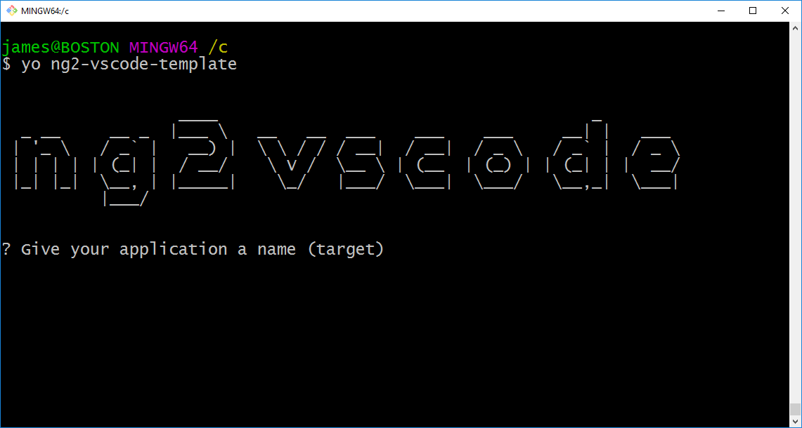

# ng2-vscode-template [](https://travis-ci.org/jamesemann/ng2-vscode-template)
Code Template for Visual Studio Code setting up a basic Angular 2.0 project structure with Gulp task runner, Jasmine unit tests and third party library (D3) integration. 


----

##Usage

```npm install --global gulp; npm install --global yo; npm install --global generator-ng2-vscode-template; yo ng2-vscode-template sampleapp; cd sampleapp; npm start;```

##Or (step by step)

1. **Install gulp** ```npm install --global gulp```
2. **Install yeoman** ```npm install --global yo```
3. **Install ng2-vscode-template** ```npm install --global generator-ng2-vscode-template```
4. **Run generator** ```yo ng2-vscode-template```.  <appname>
 
5. **Start the app** ```cd <appname>; npm start;```

---

##Provides

- Basic Angular 2.0 project structure, containing component and service.
- Gulp task runner which you can use inside VS Code or from Git Shell.
- Third party library integration (D3) as Angular component.
- Jasmine tests w/ Gulp integration.
- Lodash for convenience.
